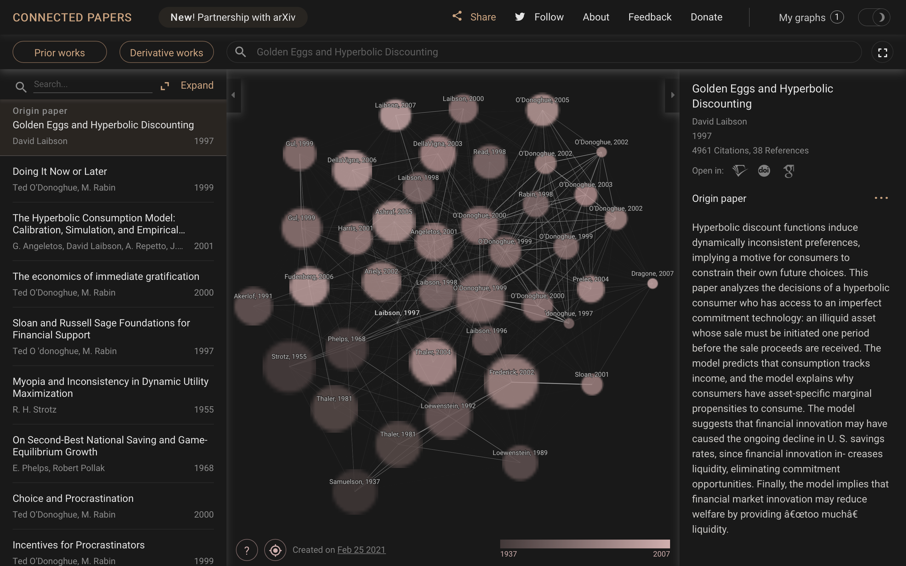

# QT18 [Connected Papers](https://www.connectedpapers.com).

> Connected papers là một công cụ trực quan hữu dụng cho các nhà nghiên cứu hay khoa học dễ dàng tìm và khám phá các bài báo papers liên quan đến lĩnh vực đang nghiên cứu

## Cách hoạt động

- Để tạo ra mỗi biểu đồ, Công cụ này phân tích gần 50,000 bài báo và chọn ra một vài bài có mối liện hệ chặt chẽ nhất so với bài báo cần tìm kiếm.

- Trong biểu đồ, các bài báo được sắp xếp dựa trên độ tương quan của chúng. Do đó dù một số bài không trực tiếp trích dẫn các bài khác, nhưng chúng vẫn có thể liên quan và được đặt gần nhau.

- Sau đó, thuật toán sẽ xây dựng Biểu đồ được hướng lực để phân phối các bài báo theo cách nhóm các bài báo tương quan lại với nhau một cách trực quan và đẩy các bài báo ít giống nhau ra xa nhau. Khi lựa chọn nút, công cụ sẽ đánh dấu đường đi ngắn nhất từ ​​mỗi nút đến trang gốc trong không gian tương tự.

- Cơ sở dữ liệu lớn và đáng tin cậy [Semantic Scholar Paper Corpus](https://www.semanticscholar.org/paper/Construction-of-the-Literature-Graph-in-Semantic-Ammar-Groeneveld/649def34f8be52c8b66281af98ae884c09aef38b) (licensed under ODC-BY).

## Tại sao chúng ta nên sử dụng Connected Papers

### &nbsp; &nbsp; 1/ Có được cái nhìn tổng quan về một lĩnh vực học thuật mới

Nhập một bài báo điển hình từ đó biểu đồ các bài báo tương tự sẽ được xây dựng. Người dùng sẽ được khám phá các bài báo thú vị, có giá trị cao thực tế về các xu hướng, các tác phẩm phổ biến và động lực của lĩnh vực quan tâm.

### &nbsp; &nbsp; 2/ Đảm bảo không bỏ lỡ các bài báo quan trọng

Trong một số lĩnh vực , rất nhiều bài báo mới được xuất bản nên rất khó để theo dõi. Với Connected Papers, người dùng chỉ cần tìm kiếm và khám phá trực quan các giấy tờ quan trọng gần đây.

### &nbsp; &nbsp; 3/ Tạo thư mục cho luận án

Bắt đầu với các tài liệu tham khảo mà người dùng chắc chắn sẽ muốn có trong thư mục của mình và sử dụng Connected Papers để lấp đầy khoảng trống và tìm phần còn lại

### &nbsp; &nbsp; 4/ Khám phá các tác phẩm trước và các tác phẩm mới phù hợp nhất

Các bài báo gốc quan trọng trong lĩnh vực quan tâm, các bài phê bình văn học về lĩnh vực này, cũng như trạng thái bài viết được xuất bản gần đây theo bài báo đầu.
